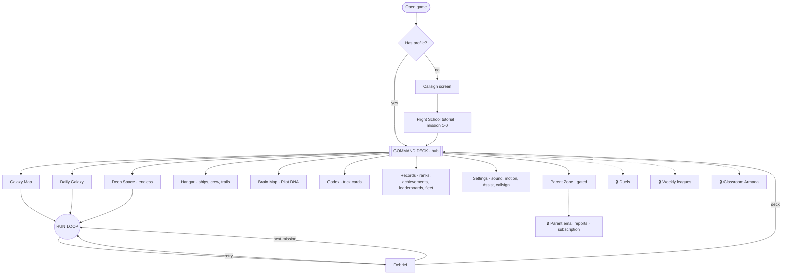
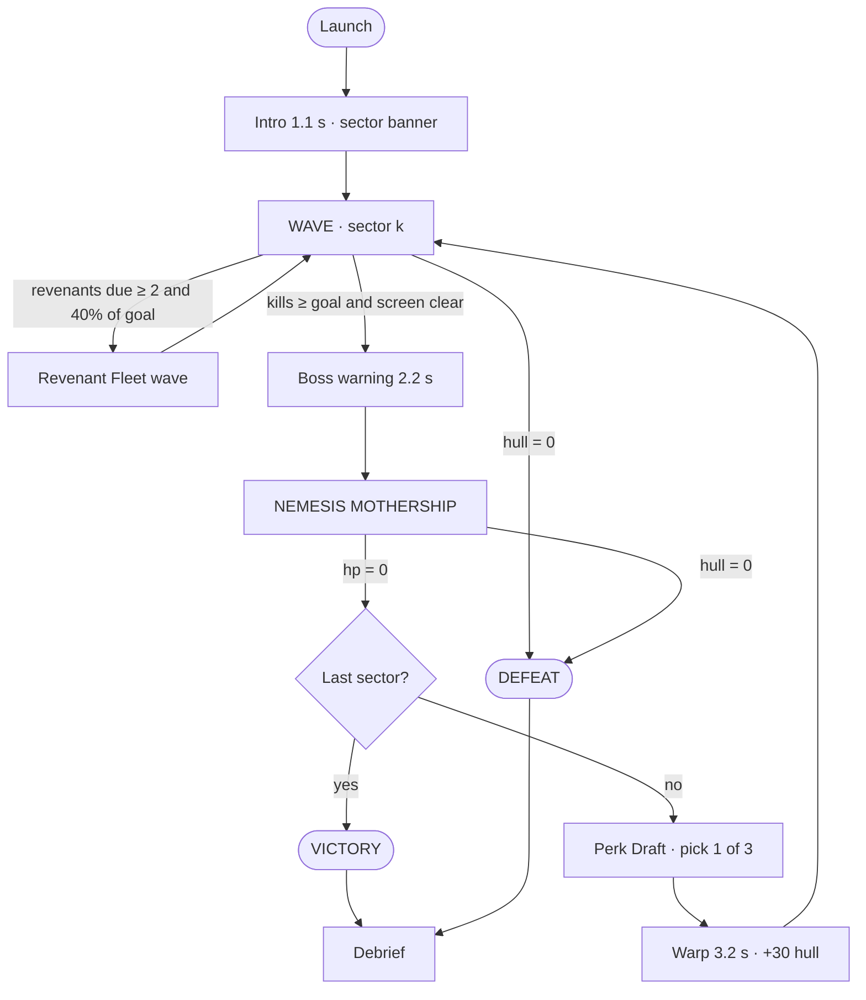
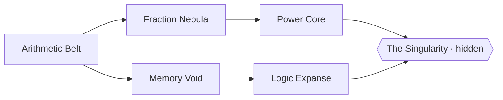
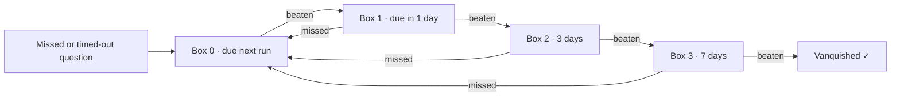

# Space Math — Master Flowmap

This is the single source of truth for how the game fits together. Every number in this document is implemented in code (file references are in brackets). Items marked **🔒 PLANNED** need a backend (accounts, payments or real-time networking) and are not built yet.

---

## 1. Player journey (top level)

---

## 2. The run loop (every mission, the Daily Galaxy and Deep Space)

### Answer resolution (every keystroke) [`game.js › _evaluate`]

| Input state | Result |
|---|---|
| Equals a hostile answer and is not a prefix of another live answer | Fire instantly |
| Equals a hostile answer **and** is a prefix of another (e.g. `5` vs `56`) | Wait 450 ms for more digits, then fire |
| Equals an **ally** answer | Friendly fire: −12 hull, streak reset |
| Not a prefix of any live answer and at least as long as the target's answer | Miss: −8 hull, streak reset |
| `Enter` | Force resolution |
| Choice threats (Mirror) | A single key, `1` or `2` |

### Damage and repair [`config.js`]

| Event | Hull |
|---|---|
| Impact (threat reaches perimeter) | −34 |
| Mothership impact | −45 (then knocked back) |
| Miss | −8 |
| Friendly fire | −12 |
| Streak repair (every 10) | +15 |
| Sector clear | +30 |

### Scoring
`points = base × (1 + 0.25 × (level−1)) × multiplier × (1.5 if BLAZING) + 25×mult if CLUTCH`
Multiplier tiers by streak: 0→×1, 5→×2, 10→×3, 20→×4, 35→×5. BLAZING ≤ 35% of the time used, CLUTCH ≥ 82%.
Special: Clean Break ×2 · Swarm ×2.5 · Revenant ×1.5 · Mothership hit = 60 + 0.5 × base.

---

## 3. Threat catalogue [`game.js`, `render.js`]

| Threat | Thinking skill trained | Behaviour |
|---|---|---|
| Asteroid | Calculation | Descends; its distance is the timer |
| Saucer | Calculation | As above, wobbles |
| **Splitter** crystal | Decomposition | Shows `24 × 15`. Unsolved at 35% of the way down, it cracks into `24 × 10` and `24 × 5` (each gets 75% time). Solving it whole first = **CLEAN BREAK ×2** |
| **Swarm** (3) | Equivalence | Three minis, three different expressions with **one shared answer** (`4×9`, `6×6`, `12×3`). One answer destroys all three, ×2.5 |
| **Cloaked** | Working memory | Problem is visible for 1.4 s, then shows `? ? ?` |
| **Beacon** | Short-term memory | Flashes a 3–6 digit code for 1.2 s + 0.3 s/digit; type it (↺ = reversed) |
| **Shield bearer** | Multi-step | Needs 2 answers: shield, then hull |
| **Mirror** | Estimation / comparison / checking | Choice: `① 47×19  ② 900 — which is bigger?` or `36×4 = 154 · ① TRUE ② FALSE` |
| **Ally cargo** | Inhibitory control | Green, crosses the screen. **Do not answer it.** It never impacts |
| **Revenant** | Spaced repetition | Replays a question you previously missed |
| **Nemesis Mothership** | Weak-skill practice | HP per mission. 60% of its questions come from your 3 weakest skills; named after the weakest ("The Percentages Dreadnought") |

---

## 4. Galaxy [`data/galaxy.js`]

A system unlocks when the previous system's Dreadnought is beaten. The Singularity appears when all 5 Dreadnoughts are beaten **or** you reach a 50-streak in any run.

| # | Mission | Skills | Threats | Level | Sectors |
|---|---|---|---|---|---|
| 1-0 | Flight School | add, sub (easy) | asteroid | 1 | 1 (boss hp 3) |
| 1-1 | Rookie Run | add, sub | asteroid, saucer | 1 | 2 |
| 1-2 | Table Storm | times tables | asteroid, saucer, swarm | 1 | 2 |
| 1-3 | Splitter Field | tables, 2d×1d | asteroid, splitter, saucer | 2 | 2 |
| 1-B | **The Carry Titan** | all above + doubles | mixed + boss hp 8 | 2 | 1 |
| 2-1 | Divide & Conquer | division, doubles/halves | asteroid, saucer, shield | 2 | 2 |
| 2-2 | Percent Rain | percentages | asteroid, saucer, swarm | 3 | 2 |
| 2-3 | Slice Squadron | fractions | saucer, shield, ally | 4 | 2 |
| 2-B | **The Fraction Leviathan** | all S2 | mixed + boss hp 9 | 4 | 1 |
| 3-1 | Signal Codes | codes | beacon, asteroid | 1 | 2 |
| 3-2 | Cloak & Dagger | tables, add (cloaked) | cloaked, saucer | 2 | 2 |
| 3-3 | Echo Chamber | codes (reversed), cloaked | beacon, cloaked, ally | 3 | 2 |
| 3-B | **The Amnesia Engine** | all S3 | mixed + boss hp 8 | 3 | 1 |
| 4-1 | Square Up | squares, roots | asteroid, saucer, splitter | 3 | 2 |
| 4-2 | Order Protocol | BODMAS, missing numbers | shield, saucer, ally | 4 | 2 |
| 4-3 | Negative Zone | negatives, powers | saucer, swarm, cloaked | 5 | 2 |
| 4-B | **The Exponent Colossus** | all S4 | mixed + boss hp 10 | 5 | 1 |
| 5-1 | Pattern Gates | sequences | asteroid, saucer | 2 | 2 |
| 5-2 | Mirror Maze | comparisons | mirror, saucer | 3 | 2 |
| 5-3 | Glitch Hunt | true/false, rounding | mirror, ally, splitter | 4 | 2 |
| 5-B | **The Paradox Core** | all S5 | mixed + boss hp 10 | 4 | 1 |
| 6-1 | **Event Horizon** | everything | everything | 6 | 4 |

**Stars:** ★ clear · ★★ accuracy ≥ 85% · ★★★ accuracy ≥ 85% **and** zero impacts.
**Dreadnought rewards:** crew member + codex card + next system.

**Deep Space** (endless) and **Daily Galaxy** unlock after Flight School.

---

## 5. Roguelite Perk Draft [`data/perks.js`]

Offered after every Mothership that isn't the last one (missions with more than 1 sector, Deep Space and Daily). Three random perks are shown; press 1, 2 or 3. Perks stack.

| Perk | Effect |
|---|---|
| Prime Hunter | Prime answers: ×2 points and +3 hull |
| Nine Lives | Multiples of 9 repair +4 hull |
| Overclock | Streak counts double; misses cost double |
| Echo Cannon | Even answers also destroy the next-most-urgent small threat |
| Time Dilation | Threats move 12% slower |
| Deflector | First impact each sector is absorbed |
| Nano Repair | +1 hull per correct answer |
| Chain Lightning | BLAZING answers also destroy one other threat |
| Bounty Hunter | +40% credits from this run |
| Steady Hands | One miss per sector doesn't break your streak |
| Scanner | Cloaked and Beacon threats stay visible +0.8 s |
| Glass Cannon | ×1.5 points, max hull −30 |

---

## 6. Revenant Fleet · spaced repetition [`services/profile.js › revenants`]

Up to 40 are stored (the oldest are dropped). Memory codes are never stored, because they are random. Up to 5 due revenants (at least 2) form a wave in sector 1 of any mission or Deep Space run once 40% of the sector goal is reached. The Daily Galaxy has no Revenants, so it stays identical for every pilot.

---

## 7. Meta progression [`services/progression.js`]

| Currency | Earned |
|---|---|
| **XP** | score ÷ 25 + 3 × kills + 150 on victory |
| **Credits** | score ÷ 80 + 40 per star + 60 on victory + 150 on first clear + 150 on first Daily of the day + achievement rewards; Bounty Hunter +40% |

**Ranks (XP):** Cadet 0 · Ensign 500 · Lieutenant 1,500 · Lt. Commander 3,000 · Commander 5,500 · Captain 9,000 · Commodore 14,000 · Rear Admiral 21,000 · Vice Admiral 30,000 · Admiral 42,000 · then Legend I, II… every +15,000.

**Hangar** [`data/ships.js`]

| Ship | Cost | Trait |
|---|---|---|
| Interceptor | free | Balanced |
| Scout | 600 | +20% time, −15% points |
| Gunship | 1,200 | +20% points, max hull 85 |
| Carrier | 2,000 | Drone auto-destroys the easiest threat once per sector |
| Phantom | beat The Singularity | Starts every run with one random perk |

Engine trails: Cyan (free) · Ember 250 · Toxic 250 · Royal 400 · Gold 800.

**Crew** (one on duty, earned from Dreadnoughts): Engineer Rao +10 max hull · Medic Ayo repair every 8-streak · Archivist Mira memory displays +40% · Gunner Kade every 5th boss hit deals double · Navigator Vega Mirror/pattern threats +25% time.

**Achievements** (20, each pays credits) · **Codex** (16 trick cards) · **Brain Map** (mastery star for every skill) · **Pilot DNA** (archetype + strengths, shareable).

Mastery per skill = accuracy × speed factor × confidence, where speed factor = clamp(2.5 s ÷ average time, 0.4, 1) and confidence = n ÷ (n + 6).
Tiers: Dim < 0.30 · Glowing < 0.55 · Bright < 0.80 · Supernova ≥ 0.80 with n ≥ 20.

---

## 8. Daily Galaxy [`game/runs.js › dailyRun`]

- The seed is today's date (UTC). Everyone gets identical threats, positions and perk offers.
- 3 sectors covering the whole skill mix. Level ramps 2 → 4. Adaptive heat is switched off, so every pilot faces the same timings.
- The **first attempt of the day is official**: it goes to the daily leaderboard and earns a +150 credit bonus. Later attempts are practice.
- The share card uses one emoji row per sector: 🟩 ≥ 90% accuracy · 🟨 ≥ 70% · 🟥 below that · 💥 Mothership down.
- A daily streak 🔥 counts consecutive days played.

## 9. Ghost race
Every mission, Daily and Deep Space records your best run's score every 2 s. During a run the HUD shows `GHOST +230` (ahead) or `GHOST −80` (behind).

## 10. Leaderboards & fleets [`server.js`]
- Boards: **Deep Space** (all time) · **Daily** (per UTC day, kept for 30 days) · **Fleet** (Deep Space filtered by a class/school code, 3–8 letters or digits).
- Moderated names and fleet codes, plausibility checks and rate limits apply to all boards.
- Runs in **Assist mode** (+30% time) are never submitted.

## 11. Settings and Parent Zone
**Settings** (open to everyone): sound, voice, reduced motion, **Assist mode** (+30% time; Assist runs are never ranked) and callsign.

**Parent Zone** (behind a written-number check): runs, play time, accuracy and answer speed for the last 7 days compared with the week before, strongest skill, suggested practice, full skill table with mastery, printable report, data export (JSON), reset progress.

---

## 12. Roadmap beyond this build 🔒

| Phase | Feature | Needs |
|---|---|---|
| 3 | Accounts & cloud save (profile sync) | Auth + database |
| 3 | Parent email/WhatsApp weekly report | Accounts + mail provider |
| 3 | Teacher dashboard & assignments | Accounts + roles |
| 3 | **Classroom Armada** (shared projector boss, room code) | WebSocket server |
| 3 | Family subscription, school licences | Payments + parental consent flow (COPPA / India DPDP) |
| 4 | Real-time duels, ghost replays of friends | WebSocket + replay storage |
| 4 | Weekly leagues (30-pilot groups, promotion) | Accounts + scheduled jobs |
| 4 | Sponsored tournaments, regional languages | Ops + i18n |

The client is already prepared for this: every answer is logged with skill id and time (`Session.log`), the profile is one JSON object (`Profile.export()`), runs are deterministic from a seed (needed for duels, replays and server verification), and the leaderboard carries `mode`, `day` and `fleet`.
